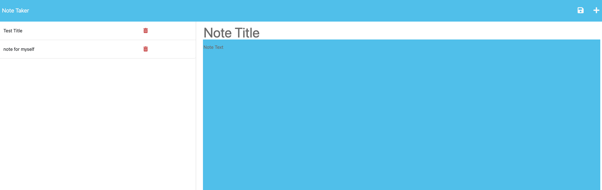

# 11 Express.js: Note Taker

This project is a note taking application created with Express.js. With this app, you can write notes, save them to a list, revisit them, and delete them. 
The created front end responds to the back end through GET and POST routes.

The application has been deployed to Heroku. 

Here are screenshots of the deployed application. 

